# Projeto Banco Digital - API

## 1. Identificação

- Integrante 1: **Lucas Derenze Simidu** - RM **555931**
- Integrante 2: **Sofia Fernandes** - RM **554873**

## 2. Produto bancário escolhido e justificativa

- Produto escolhido: **Empréstimo**
- Justificativa: o produto permite validar regras reais de negócio financeiro, incluindo cálculo de parcela e análise de aprovação baseada em comprometimento de renda.

### Regra de negócio extra (escopo dupla)

- Foi implementada regra adicional de análise para empréstimo:
  - Cálculo de parcela pela tabela PRICE (`CalcularValorParcela()`).
  - Aprovação por renda: parcela deve ser menor ou igual a 30% da renda mensal (`AprovarPorRenda(decimal rendaMensal)`).

## 3. Tecnologias utilizadas

- .NET 8.0
- ASP.NET Core Web API
- Entity Framework Core
- Oracle Database (oracle.fiap.com.br:1521/ORCL)
- Swagger (Swashbuckle)

## 4. Diagrama de classes

- Arquivo do diagrama: **`/docs/diagrama.png`**
  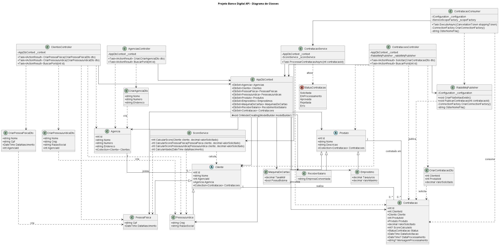

## 5. Como executar o projeto

### Pré-requisitos

- .NET SDK 8
- Acesso ao Oracle FIAP

### Configuração

1. Ajustar a connection string em `Fiap.Banco.API/appsettings.json`:

```json
"ConnectionStrings": {
  "OracleConnection": "User Id=[SEU_RM];Password=[SUA_SENHA];Data Source=oracle.fiap.com.br:1521/ORCL"
}
```

2. Aplicar migrations:

```powershell
dotnet ef database update
```

3. Executar a API:

```powershell
dotnet run --project Fiap.Banco.API/Fiap.Banco.API.csproj
```

4. Abrir Swagger:

- `http://localhost:5051/swagger` (ou a porta exibida no console)

## 6. Endpoints disponíveis com exemplos de request/response em JSON

### POST `/api/agencias`

Request:

```json
{
  "nmAgencia": "Agencia Paulista",
  "dsEndereco": "Av. Paulista, 1000"
}
```

Response `201 Created` (exemplo):

```json
{
  "idAgencia": 1,
  "nmAgencia": "Agencia Paulista",
  "dsEndereco": "Av. Paulista, 1000"
}
```

Evidência:
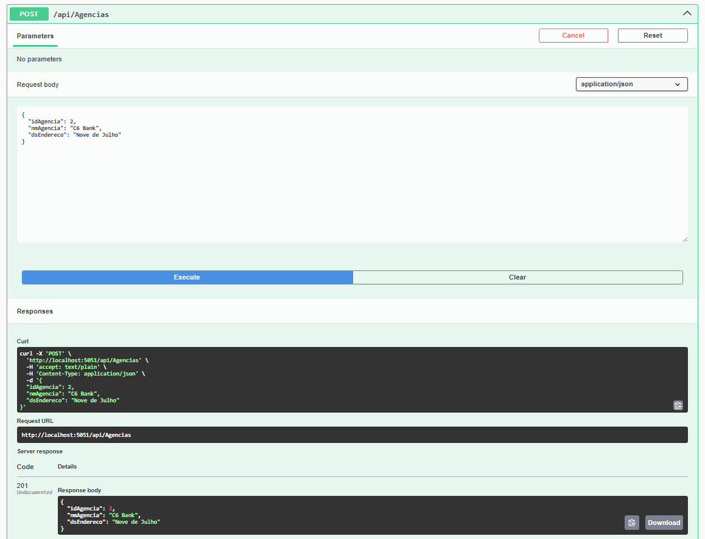

### GET `/api/agencias/{id}`

Response `200 OK` (exemplo):

```json
{
  "idAgencia": 1,
  "nmAgencia": "Agencia Paulista",
  "dsEndereco": "Av. Paulista, 1000"
}
```

Evidência:
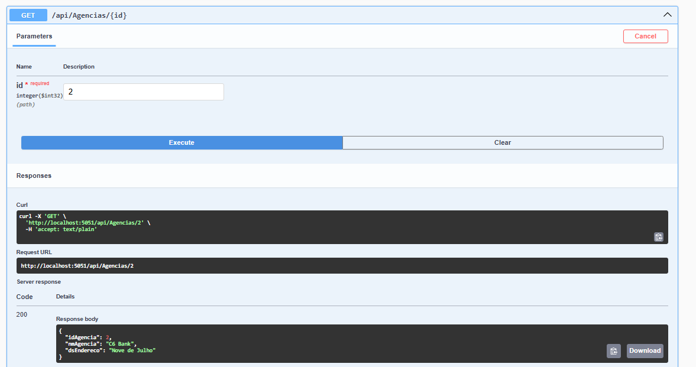

### POST `/api/clientes/pf`

Request:

```json
{
  "nome": "Ana Silva",
  "agenciaId": 1,
  "cpf": "12345678901",
  "dataNascimento": "1995-03-10T00:00:00"
}
```

Evidência:


Response `201 Created` (exemplo):

```json
{
  "id": 1,
  "nome": "Ana Silva",
  "agenciaId": 1,
  "agencia": null,
  "cpf": "12345678901",
  "dataNascimento": "1995-03-10T00:00:00"
}
```

### POST `/api/clientes/pj`

Request:

```json
{
  "nome": "Empresa XPTO",
  "agenciaId": 1,
  "cnpj": "12345678000199",
  "razaoSocial": "Empresa XPTO LTDA"
}
```

Evidência:
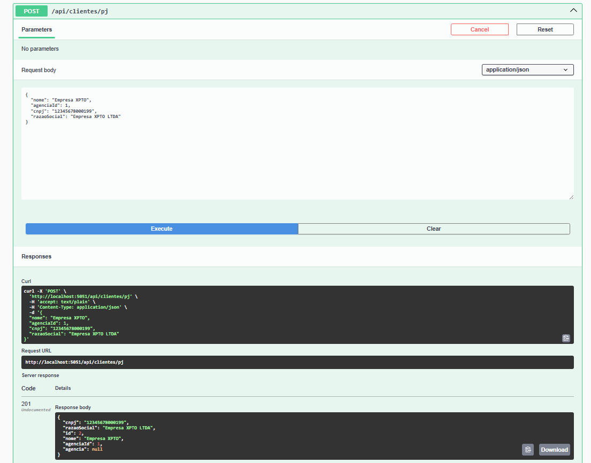

Response `201 Created` (exemplo):

```json
{
  "id": 2,
  "nome": "Empresa XPTO",
  "agenciaId": 1,
  "agencia": null,
  "cnpj": "12345678000199",
  "razaoSocial": "Empresa XPTO LTDA"
}
```

### GET `/api/clientes/{id}`

Response `200 OK` (exemplo):

```json
{
  "id": 1,
  "nome": "Ana Silva",
  "agenciaId": 1,
  "agencia": {
    "idAgencia": 1,
    "nmAgencia": "Agencia Paulista",
    "dsEndereco": "Av. Paulista, 1000"
  }
}
```

Evidências:
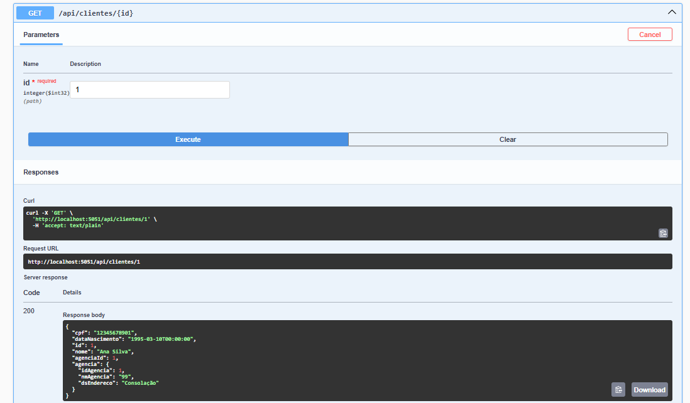
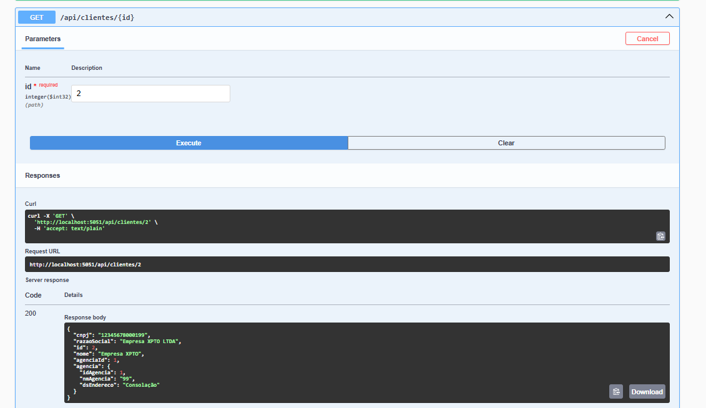

### POST `/api/produtos/emprestimo`

Request:

```json
{
  "nomeProduto": "Emprestimo Pessoal",
  "ativo": true,
  "valorSolicitado": 10000,
  "taxaJurosMensal": 2.5,
  "quantidadeParcelas": 24
}
```

Response `201 Created` (exemplo):

```json
{
  "idProduto": 1,
  "nomeProduto": "Emprestimo Pessoal",
  "ativo": true,
  "valorSolicitado": 10000,
  "taxaJurosMensal": 2.5,
  "quantidadeParcelas": 24
}
```

Evidências:
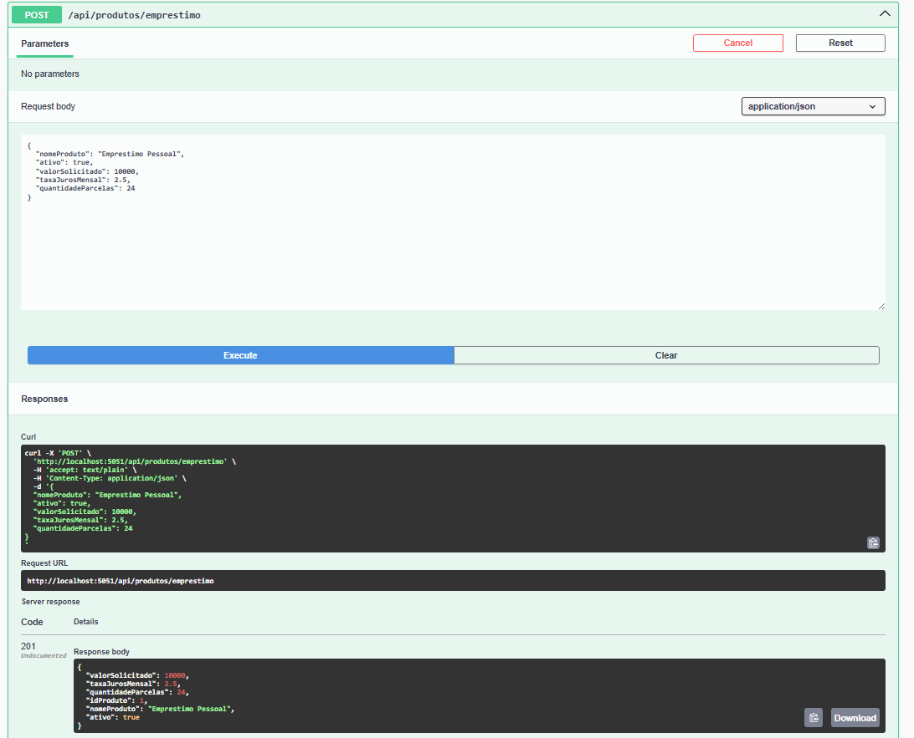
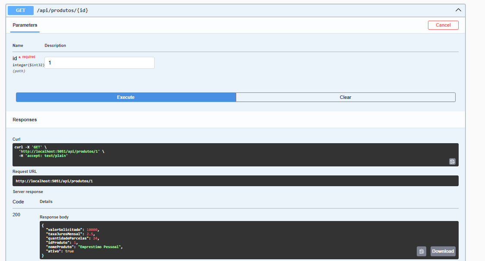

### POST `/api/contratacoes`

Request:

```json
{
  "clienteId": 1,
  "produtoId": 1
}
```

Evidência:
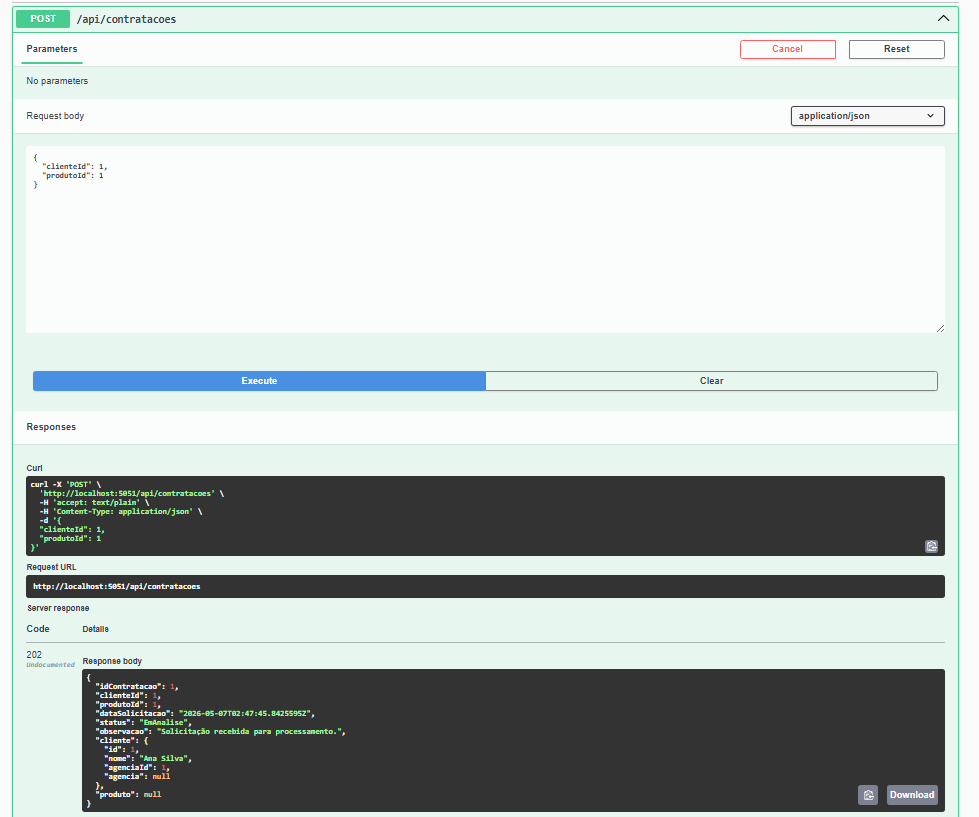

Response `202 Accepted` (exemplo):

```json
{
  "idContratacao": 1,
  "clienteId": 1,
  "produtoId": 1,
  "dataSolicitacao": "2026-05-07T00:00:00Z",
  "status": "EmAnalise",
  "observacao": "Solicitação recebida para processamento.",
  "cliente": null,
  "produto": null
}
```

### GET `/api/contratacoes/{id}`

Response `200 OK` (exemplo):

```json
{
  "idContratacao": 1,
  "clienteId": 1,
  "produtoId": 1,
  "dataSolicitacao": "2026-05-07T00:00:00Z",
  "status": "EmAnalise",
  "observacao": "Solicitação recebida para processamento.",
  "cliente": {
    "id": 1,
    "nome": "Ana Silva",
    "agenciaId": 1
  },
  "produto": {
    "idProduto": 1,
    "nomeProduto": "Emprestimo Pessoal",
    "ativo": true
  }
}
```

Evidência:
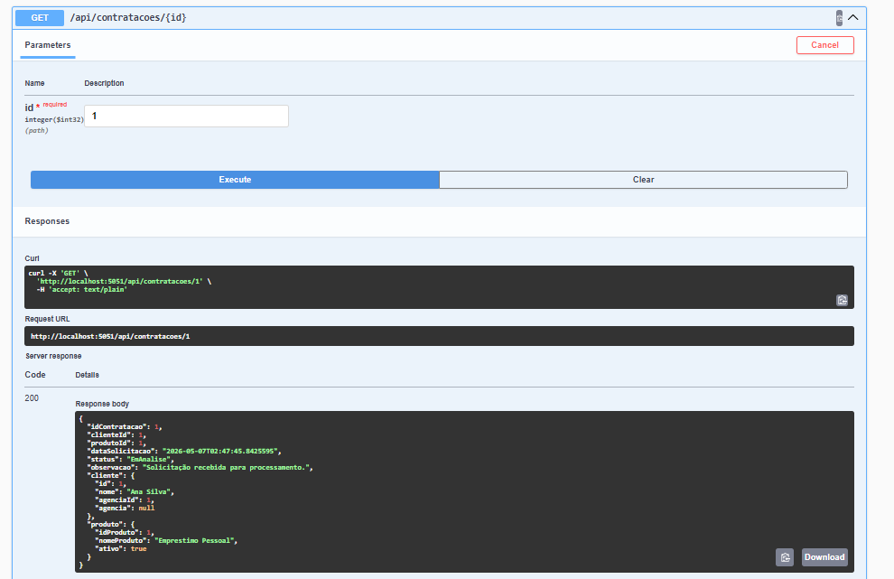

### Evidências adicionais de Agência (PUT/DELETE)

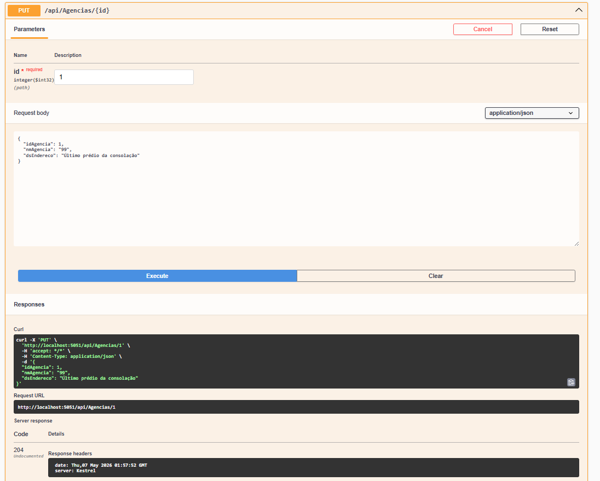
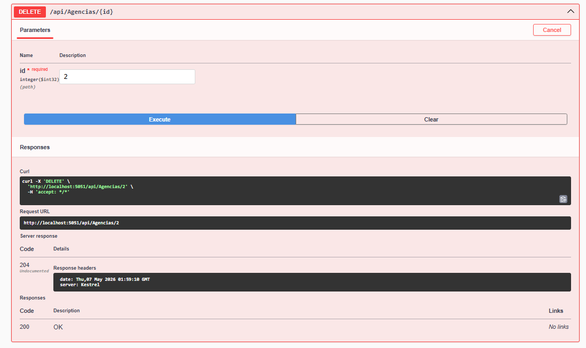
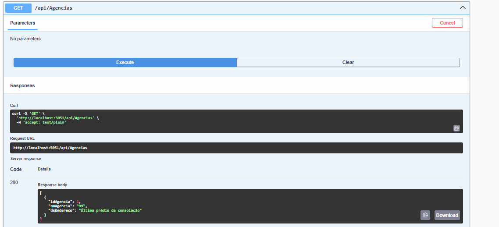

## Observações importantes

- O projeto implementa os endpoints mínimos exigidos para agência, clientes PF/PJ e contratações.
- Também inclui endpoint de apoio para criação do produto de empréstimo: `POST /api/produtos/emprestimo`.
- O domínio contém herança/discriminator para Cliente (PF/PJ) e Produto (Emprestimo, MaquinaDeCartao, ReceberSalario).
- O produto escolhido pela dupla foi **Empréstimo**, com regra de cálculo e critério adicional de aprovação por renda.
